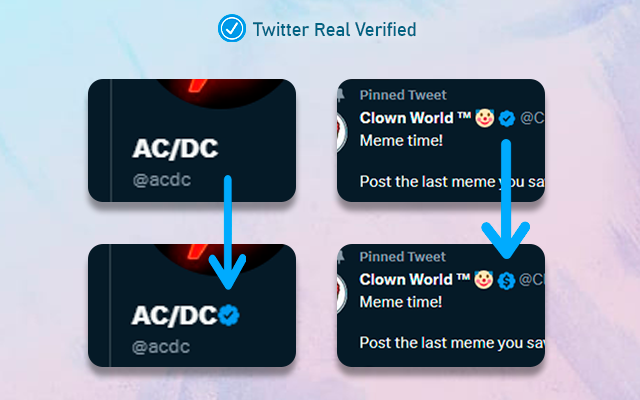
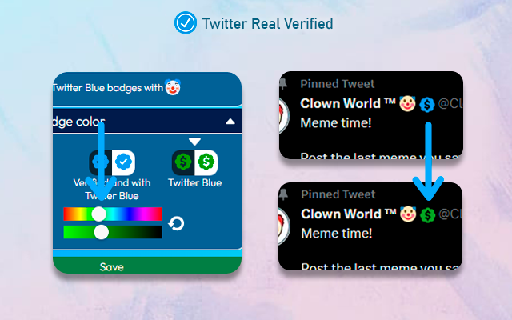
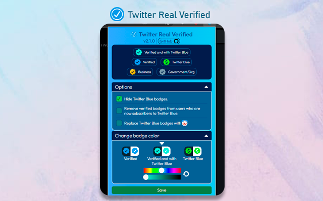

<p align="center">
  
</p>
<h3 align="center">Twitter Real Verified v2.1.8</h3>
<p align="center">
This is a fork of the browser extension of the same name. It aims to bring back Twitter's legacy verification and distinguishes Twitter Premium/Premium (née Blue) users vs legacy verified users. 
</p>

<p align="center">

## Overview
<p>Installing this add-on will restore all the legacy verified badges that were removed due to Twitter Blue/Premium changes on April 20, 2023. Some badges have since been <a href="https://www.washingtonpost.com/technology/2024/04/04/x-blue-check-mark-elon-musk/" target="_blank">chaotically restored</a> to a group of accounts, but you will still be able to identify former verified accounts if you prefer to do so.</p>
<p>The list of legacy verified users was taken before April 4, 2023. Thanks to the data collected by <a href="https://twitter.com/travisbrown/status/1649129052479844363">Travisbrown</a>, you can find the complete list on: <a href="https://gist.github.com/travisbrown/b50d6745298cccd6b1f4697e4ec22103">Twitter accounts with legacy verification</a>.

### Options
- Hide Twitter Blue/Premium badges.
- Remove the verification badge from users who have Twitter Blue/Premium.
- Replace Twitter Blue/Premium badges with 🤡.
- Add a simple green checkmark to legacy verified accounts.

### Change badge color
- Change the badge color for verified users, Blue/Premium users, and verified users who have Blue/Premium.
  
<p align="center">
  
  
  
</p>

## What's New 
### v2.1.7:
- Fix bug when showing verified badges.

### v2.1.6 
- Fixed minor issue in Chrome Dev: popup's width broken.

Complete logs: <a href="https://github.com/luiserdef/twitter-real-verified/releases">Releases</a>

## Dev
Popup is created with React.
The project uses esbuild.

After cloning the project, do the following:

```bash
 # Install pnpm 
 npm install -g pnpm 
 
 # Install dependencies
 pnpm install 

 # Generate the files for Chrome
 pnpm run build-chrome
 
 # Generate the files for Firefox
 pnpm run build-firefox
 
 # Run and fix linter issues 
 npx standard --fix 
 # If you have the standardjs extension for VSCode, changes are made on save.
```

Alternatively, you can use `bun` instead of `pnpm` to run the commands. 

### Legacy verified list
This extension uses the screenname from the legacy verified list — most of which used to be followed by the now quasi-dormant @Verified account. The use of user IDs is being addressed in the userids branch. The data was graciously provided by <a href="https://twitter.com/travisbrown/status/1649129052479844363">Travisbrown</a> and can be found here: <a href="https://gist.github.com/travisbrown/b50d6745298cccd6b1f4697e4ec22103">legacy-verified</a>.

The verified user list is splitted in two files and has the following format:
```bash
[{
  "key": "u",
  "users": ["username","username2"]
}]

# key: The first character of the username.
# users: An array of all the usernames where the first character matches the "key"

```
You can generate the files by running this python script.

```bash
# Move to the verifiedList folder
cd verifiedList
 
# Run the script
python generateVerifiedUserList.py
```
You have to have Python installed. The output files are used in `./src`.

### Test extension
Load the extension on Chrome, Edge, or any Chromium-based browser:

- Access `edge://extensions/`, `chrome://extensions/`, or any browser extension page (e.g., `browser://extensions/`);
- Check Developer mode;
- Click on Load unpacked extension;
- Select the folder: chrome-extension.

Load the extension on Firefox

- Open the `about:debugging` page;
- Click the This Firefox option (can also be seen as This Nightly, This Dev Edition, etc.);
- Click the Load Temporary Add-on... button;
- Select any file in the folder firefox-extension.

## :bulb: Can I contribute?
Of course! You can open a new issue, or a pull request with a new improvement, or fix bugs.
